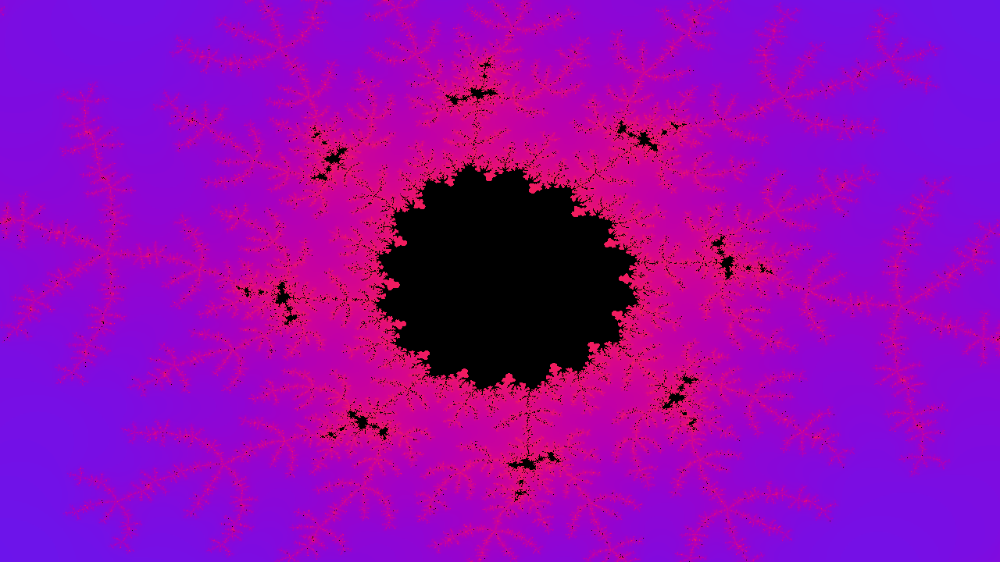
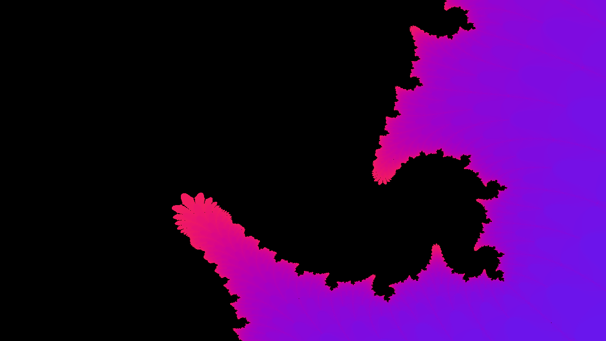

# Mandelbrot Kumir
Программа для рендера можества Мандельброта в разный точкх и с разным масштабом. Использует только стандартые исполнители

## Как запустить?
1. Скачать и установить КуМир 2 [тут](https://www.niisi.ru/kumir/dl.htm)
2. Скачать и распаковать репозиторий
3. Запустить КуМир-Про (тестировалось в нем, работа в других версиях не гарантируется)
4. Нажать "Загрузить программу..."
5. Выбрать файл Mandelbrot.kum
6. Настроить (при необходимости)
7. Запустить (кнопка "плей" сверху)

## Как настроить?
В файле Raytracing.kum есть разделы, отмеченные `||`

В разделе "Настройки" находятся все доступные настройки. **!!! НЕЛЬЗЯ ТРОГАТЬ ЗНАЧЕНИЯ В ДРУГИХ РАЗДЕЛАХ !!!**

В алгоритме `получитьЦвет` настраиваются цветовые схемы
Для создания своей цветовой схеы надо добавить условие в `выбор-при-все` и задать в нем значения для `к` (красный), `з` (зеленый), `с` (синий) на основе значения `итер` (количество итераций)

### Типы данных 
| Тип  | Описание                     |
| ---- | ---------------------------- |
| цел  | Целое число                  |
| вещ  | Число с плавающей запятой    |
| лог  | Логическое значение (да/нет) |
| цвет | Цвет                         |

